# ACCESSING SYSTEM...

<div align="center">
  
  
  [](https://git.io/typing-svg)
</div>

<div align="center">
  <a href="https://github.com/Petermartin064"></a>
</div>

```
_____  ______ _______ ______ _____  __  __          _____  _______ _____ _   _ 
|  __ \|  ____|__   __|  ____|  __ \|  \/  |   /\   |  __ \|__   __|_   _| \ | |
| |__) | |__     | |  | |__  | |__) | \  / |  /  \  | |__) |  | |    | | |  \| |
|  ___/|  __|    | |  |  __| |  _  /| |\/| | / /\ \ |  _  /   | |    | | | . ` |
| |    | |____   | |  | |____| | \ \| |  | |/ ____ \| | \ \   | |   _| |_| |\  |
|_|    |______|  |_|  |______|_|  \_\_|  |_/_/    \_\_|  \_\  |_|  |_____|_| \_|
                                                                                          
```

<div align="center">

### `$ SYSTEM INFO`


</div>

<br />

<div id="terminal">

```bash
peter@github:~$ whoami
petermartin064

peter@github:~$ cat profile.json
{
  "name": "Peter Martin",
  "title": "Software Developer",
  "location": "Earth",
  "status": "Building innovative solutions",
  "interests": ["Coding", "Problem Solving", "Learning New Tech"]
}

peter@github:~$ ls -la skills/
total 8
drwxr-xr-x  2 peter peter 4096 Apr 04 2025 .
drwxr-xr-x 10 peter peter 4096 Apr 04 2025 ..
-rw-r--r--  1 peter peter  220 Apr 04 2025 languages.txt
-rw-r--r--  1 peter peter  340 Apr 04 2025 frameworks.txt
-rw-r--r--  1 peter peter  180 Apr 04 2025 tools.txt

peter@github:~$ cat skills/languages.txt
JavaScript
Python
HTML/CSS
SQL
TypeScript

peter@github:~$ cat skills/frameworks.txt
React
Node.js
Express
Django
TensorFlow

peter@github:~$ cat skills/tools.txt
Git
Docker
AWS
VS Code
Linux

peter@github:~$ ./run_stats.sh
Running system diagnostics...
```

</div>

<div align="center">

### `$ SYSTEM METRICS`


</div>

<div id="terminal">

```bash
peter@github:~$ ./scan_projects.sh
Scanning repositories...
```

</div>

<div align="center">

<div align="center">
  <a href="https://Petermartin064.github.io/petermartin-dashboard" target="_blank">
    
  </a>
</div>

</div>

<div id="terminal">

```bash
peter@github:~$ ./check_contributions.sh
Analyzing contribution patterns...
```

</div>

<div align="center">

### `$ CONTRIBUTION MATRIX`


</div>

<div id="terminal">

```bash
peter@github:~$ ./establish_connection.sh
Establishing secure connection channels...
```

</div>

<div align="center">

### `$ COMMUNICATION CHANNELS`

<a href="https://www.linkedin.com/in/peter-martin064/">
  
</a>
<a href="https://x.com/KirikaMart">
  
</a>
<a href="mailto:petermartin602.com">
  
</a>

</div>

<div id="terminal">

```bash
peter@github:~$ ./get_random_quote.sh
Fetching inspiration...
```

</div>

<div align="center">

### `$ SYSTEM MESSAGE`


</div>

<div id="terminal">

```bash
peter@github:~$ exit
Closing connection...
Connection terminated. Thank you for visiting!
```

</div>

<!-- <div align="center">
  
</div> -->

<div align="center">
  
</div>

